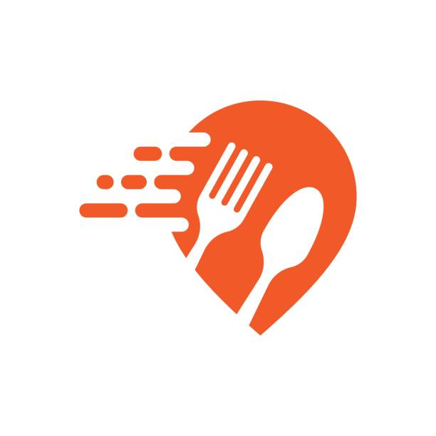

<p align="center">
  
</p>

<h1 align="center">QuickBite — Online Food Ordering System</h1>

<p align="center">
  A full-stack PHP &amp; MySQL web application for browsing a restaurant menu, placing orders,
  and managing everything from a dedicated admin dashboard.
</p>

---

## 📋 About the Project

QuickBite is a dynamic, database-driven food ordering platform built for restaurants and
cafes that want a lightweight, self-hosted ordering system. Customers can create an account,
browse a categorized menu, view special offers, add items to their cart, and place orders —
while the restaurant owner manages the entire operation (menu, offers, orders, and users)
from a secure admin panel.

## ✨ Features

### Customer
- 🔐 User registration, login, and profile management (update details & password)
- 🍽️ Browse the menu by category, with images, prices, and star ratings
- 📦 Live stock status — items are shown as in-stock or out-of-stock in real time
- 🏷️ Automatic display of active, time-bound discount offers
- 🛒 Add to cart, review totals, and place orders
- ✉️ Contact form that sends messages directly to the admin

### Admin
- 📊 Dashboard with at-a-glance stats — total orders, pending orders, today's revenue,
  menu items, active offers, users, and messages — plus visual charts
- 🍔 Full menu management (add / edit / delete items, toggle availability)
- 🏷️ Offer management with scheduled start and end dates
- 📦 Order management with status tracking
- 👥 User management for registered customers
- 🔒 Session-protected admin routes (`admin_auth_check.php`)

## 🛠️ Tech Stack

| Layer | Technology |
|---|---|
| Frontend | HTML5, CSS3, JavaScript |
| Backend | PHP |
| Database | MySQL / MariaDB (via phpMyAdmin) |
| Server | Apache (XAMPP / WAMP / LAMP) |

## 🗄️ Database Overview

The application uses a single database (`food`) with the following core tables:

| Table | Purpose |
|---|---|
| `users` | Customer accounts (name, email, password, contact, address) |
| `admin` | Admin login credentials |
| `menu_items` | Category, name, price, rating, image, availability |
| `offers` | Discount offers linked to a menu item, with start/end dates |
| `orders` | Order header — customer, status, grand total, timestamps |
| `order_items` | Line items linking an order to menu items & quantities |
| `contact_messages` | Messages submitted via the Contact Us form |

The full schema and sample data are provided in [`food (7).sql`](<food (7).sql>).

## 📂 Project Structure

```
QuickBite-Online-Food-Ordering-System/
├── admin/                  # Admin panel (dashboard, menu, offers, orders, users)
│   ├── admin_dashboard.php
│   ├── menu.php
│   ├── offers.php
│   ├── manage_orders.php
│   └── Manage_Users.php
├── Images/                  # Menu & category images used across the site
├── uploads/                 # User-uploaded / dynamically added item images
├── index.php                 # Home page
├── menu.php                  # Customer menu page
├── cart.php                  # Shopping cart
├── order.php                 # Order placement
├── login.php / create_user.php   # Authentication
├── profile.php                # Customer profile management
├── contact.php                # Contact Us form
├── food (7).sql               # Database schema & seed data
└── README.md
```

## ⚙️ Getting Started

### Prerequisites
- A local server stack with PHP 8+ and MySQL/MariaDB — e.g. [XAMPP](https://www.apachefriends.org/) or [WAMP](https://www.wampserver.com/)

### Installation

1. **Clone the repository**
   ```bash
   git clone https://github.com/ahdave1573-dev/QuickBite-Online-Food-Ordering-System.git
   ```
2. **Move the project** into your server's web root (e.g. `htdocs/` for XAMPP).
3. **Create the database** — open phpMyAdmin, create a database named `food`, and import
   [`food (7).sql`](<food (7).sql>).
4. **Configure the connection** — the default connection used across the project is:
   ```php
   $host = "localhost";
   $username = "root";
   $password = "";
   $database = "food";
   ```
   Update these values in the relevant PHP files if your local MySQL credentials differ.
5. **Start Apache & MySQL** and open the project in your browser, e.g.
   `http://localhost/QuickBite-Online-Food-Ordering-System/`.
6. **Admin login** — use the seeded credentials from the `admin` table
   (`admin` / `123`) at `admin/admin_login.php`, then **change the password** before
   using this in anything beyond local development.

## 🚀 Future Enhancements

- Integrate a real payment gateway (Razorpay / Stripe)
- Live order tracking with SMS/email notifications
- A REST API layer to support a future mobile app
- Customer reviews & ratings tied to actual orders
- Role-based access for multiple admin/staff accounts

## 👤 Author

**Anshul Dave**
📧 [ahdave1573@gmail.com](mailto:ahdave1573@gmail.com)
🔗 [GitHub Repository](https://github.com/ahdave1573-dev/QuickBite-Online-Food-Ordering-System)

## 📄 License

This project is available for educational and personal use. Please reach out to the author
for any other usage.
